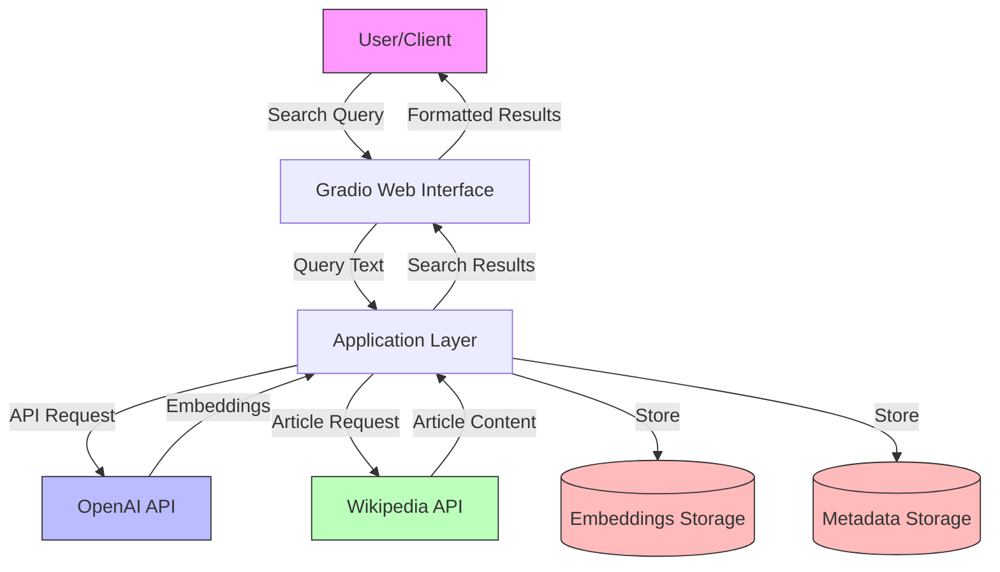
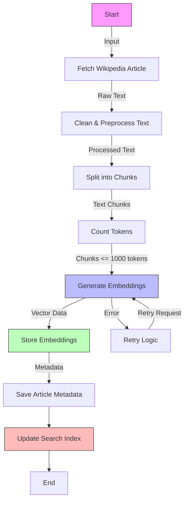
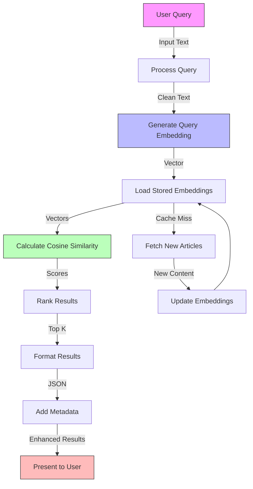
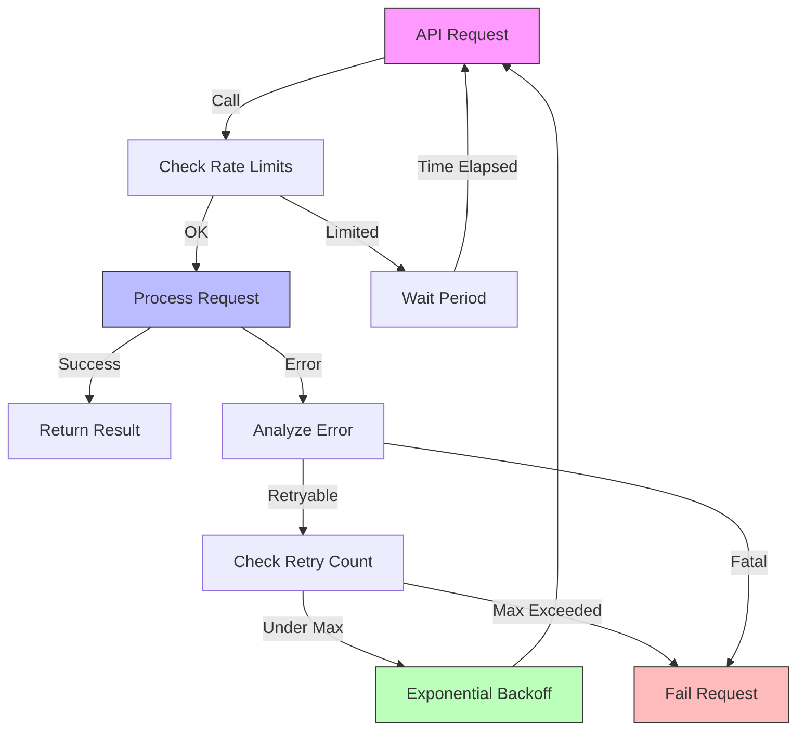
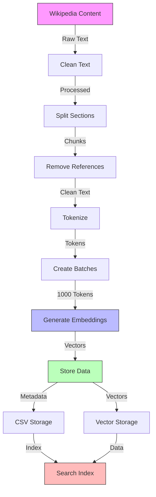

# Wikipedia Semantic Search

A powerful semantic search engine for Wikipedia articles using OpenAI embeddings and natural language processing. This application allows users to search Wikipedia content using natural language queries and returns semantically relevant results.

## 🌟 Features

- Semantic search using OpenAI's text embeddings
- Real-time Wikipedia article fetching and processing
- Interactive Gradio web interface
- Structured logging for debugging and monitoring
- Rate limiting and retry mechanisms for API calls
- Automatic text chunking and processing
- Cosine similarity-based search results ranking

## 🛠 System Architecture

### High-Level System Overview



### Embedding Generation Process



### Search Process Flow



### Error Handling and Retry Mechanism



### Data Processing and Storage Flow



## 🛠️ Prerequisites

- Python 3.8+
- OpenAI API key
- Internet connection for Wikipedia access
- 📦 Installation

1. Clone the repository:

   ```bash
   git clone https://github.com/yourusername/wikipedia-semantic-search.git
   cd wikipedia-semantic-search
   ```
2. Install required packages:

   ```bash
   pip install -r requirements.txt
   ```
3. Create a `.env` file in the project root:

   ```bash
   OPENAI_API_KEY=your_api_key_here
   ```

## 🚀 Usage

1. Start the application:

   ```bash
   python app.py
   ```
2. Access the Gradio interface at `http://localhost:7860`
3. Using the Search Interface:

   - Enter your search query
   - Adjust results count (1-10)
   - Click "Search"
   - View results with title, URL, summary, and relevance score

Example Queries:

- "What is quantum computing?"
- "Explain artificial intelligence"
- "History of space exploration"

## 🏗️ Project Structure

```
wikipedia-semantic-search/
├── app.py                 # Main application file
├── embedding_generator.py # Embedding generation
├── text_processor.py     # Text processing utilities
├── wiki_loader.py        # Wikipedia article fetching
├── utils.py             # Utility functions
├── main.py              # Entry point
├── requirements.txt     # Dependencies
└── data/               # Data storage
    ├── embeddings/     # Stored embeddings
    └── metadata.csv    # Article metadata
```

## 🔧 Technical Details

### Embedding Generation

- Uses OpenAI's `text-embedding-3-small` model
- Processes text in 1000-token batches
- Caches embeddings for performance

### Text Processing

- Splits articles into semantic chunks
- Removes references and unwanted sections
- Maintains hierarchical section structure

### Search Algorithm

1. Converts query to embedding
2. Computes cosine similarity
3. Ranks by similarity score
4. Returns top-k relevant sections

## 🔍 Advanced Usage

### Custom Search Parameters

```python
# Category search configuration
articles = fetch_wikipedia_articles(
    category_title="Artificial Intelligence",
    max_depth=2,
    max_articles=10
)

# Similarity search configuration
results = search_embeddings(
    query_embedding,
    embeddings_df,
    metadata,
    top_k=5
)
```

### Batch Processing

```python
from embedding_generator import generate_and_save_embeddings

categories = ["Artificial Intelligence", "Machine Learning", "Deep Learning"]
for category in categories:
    generate_and_save_embeddings(category, max_depth=2)
```

## 📊 Performance Notes

- Cached embeddings for faster response
- Rate-limited Wikipedia API calls
- Automatic retry for failed requests
- Structured logging system

## 🤝 Contributing

1. Fork the repository
2. Create a feature branch
3. Commit your changes
4. Push to the branch
5. Create a Pull Request
